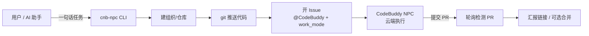

前阵子发现 [CNB](https://cnb.cool) 平台上的 CodeBuddy NPC：在仓库的 Issue 里 `@CodeBuddy` 并开启工作模式，它就能自己完成需求理解、读代码、建分支、写代码、提 PR 的整个流程——相当于在远程仓库里养了一个 AI 员工。

想法很好，但手动操作太繁琐：注册 → 建仓库 → 推送代码 → 开 Issue → 等结果 → 反复刷新页面。所以我把这套流程封装成了一个零依赖的 Node.js CLI：**cnb-npc-skill**，一条命令搞定全链路。

## 它怎么用

```bash
# 首次引导（仅一次：注册 + 生成并粘贴令牌）
node bin/cnb-npc.js onboard

# 派发任务：建仓库 → 推代码 → 开 Issue(@CodeBuddy + 工作模式) → 轮询 → 汇报 PR
node bin/cnb-npc.js run "写一个 Python 脚本 hello.py，输出 Hello, CodeBuddy NPC!"

# 在现有代码仓库上干活
node bin/cnb-npc.js run "修复登录页的 XSS 漏洞" --dir ./web-app --org my-org --repo web-app --merge
```

全程人工步骤只剩两件事：注册 CNB 账号、粘贴访问令牌。

## 实测效果

我用它派了个"写 hello.py + README"的小任务，**240 秒内 NPC 就提交了 PR**：

- Issue：[ziyim/hello-npc#1](https://cnb.cool/ziyim/hello-npc/-/issues/1)
- PR：[ziyim/hello-npc#2](https://cnb.cool/ziyim/hello-npc/-/pulls/2) — `feat: 添加 hello.py 脚本及 README 使用说明`

其中关键一点：创建 Issue 时传 `work_mode: true` 就能通过 API 直接开启工作模式（NPC 获得写代码、建分支、提 PR 的权限），不用再到网页勾选"替我上班"。

## 它到底是什么

先说结论：CodeBuddy NPC **不是**"CodeBuddy 接了一些 MCP"。准确机制是：Issue/PR 评论里 `@` 触发（`issue.comment@npc` 事件）→ 平台拉起 NPC 运行时 → 基于 CodeBuddy SDK 的 Agent 自主获取仓库上下文、调用 CNB Skills（OpenAPI / CNB CLI 封装）操作仓库、Issue、PR → 在工作模式授权下写代码、提 PR → 等验收。

和编辑器里实时给建议的 Copilot 不同，它是**异步接单、自主执行、提交 PR 等验收**的云端智能体。它的角色、提示词与行为都是开源的：[npc/CodeBuddy](https://cnb.cool/npc/CodeBuddy)（支持 fork 自定义角色、SOP 与 Skills，内置 deepseek-v4-pro/flash、glm-5.3、kimi-k3、hy3 等模型可选）。

## 为什么要用它

当成"干杂活的子智能体"：主力 agent（Claude Code、AtomCode 这类）保留给需要复杂推理的任务，**已经规划好、按部就班的任务，以及简单但繁琐的任务**交给 NPC 在云端异步执行。收益：

- **不占主力 agent 的上下文**：任务在 CNB 云端独立执行，不挤占本地对话窗口
- **不占模型并发输出**：NPC 走 CNB 平台自己的模型资源，和本地 API 额度互不影响
- **免费**：当前 CodeBuddy NPC 临时免费（官方原话"临时免费，年后再说"）
- **质量可靠**：提示词给得相对完整时输出质量很高，大项目和批量数据处理都适用

## 架构



## 项目信息

- **GitHub**：[Zi-Yi-Ming/cnb-npc-skill](https://github.com/Zi-Yi-Ming/cnb-npc-skill)（MIT 协议，零依赖）
- **特性**：首次引导 / 自动建组织仓库 / 工作模式 API 直开 / 智能轮询 / 可被 AI 助手调用（内置 SKILL.md）/ 令牌安全

技术细节（OpenAPI 接口映射、授权范围、注意事项）都写在 README 里了，感兴趣可以去看。
